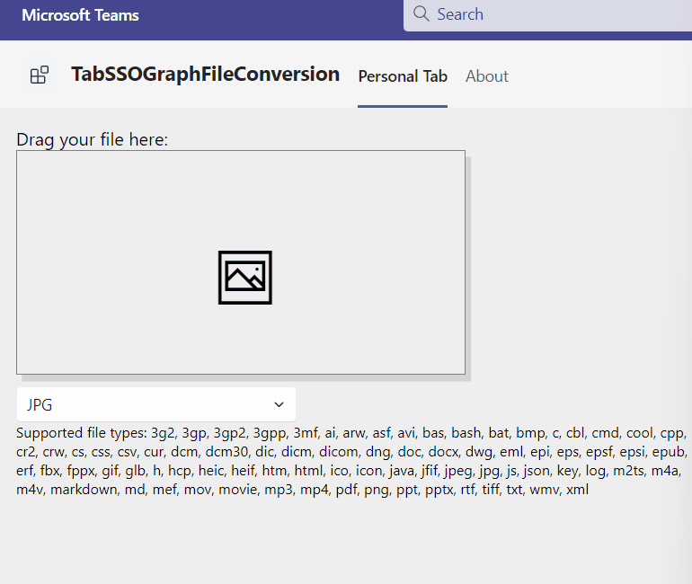

# tab-sso-graph-file-conversion

## Summary
This Teams Tab enables a user to upload a supported (depending on the target) file type via drag and drop while the uploaded file will be converted as PDF, HTML, JPG depending on user's selection.
In Teams context (as configurable Tab) it uses the current Teams' site and the default drive. In case of a personal tab the SharePoint root site's default drive'
It uses the following capabilities (mostly) on behalf of Microsoft Graph:
* Use HTML5 drag and drop event handling
* Writing normal files smaller 4MB
* Writing files bigger than 4MB with a resumable upload
* Retrieving files with format=pdf/html/jpg conversion which is currently supportred only with Graph beta endpoint

Select target file type:



File upload and JPG conversion


For further details see the author's [blog post](https://mmsharepoint.wordpress.com/2022/)

## Applies to

This sample was created [using the Teams Toolkit with Visual Studio 2022](https://learn.microsoft.com/en-us/microsoftteams/platform/toolkit/teams-toolkit-fundamentals?pivots=visual-studio&WT.mc_id=M365-MVP-5004617). The sample was also realized with Graph v1.0 enpoint as [PDF only conversion](https://github.com/mmsharepoint/tab-sso-graph-upload-pdf-csharp) and can be found [here](https://github.com/mmsharepoint/tab-sso-graph-upload-as-pdf).

## Version history

Version|Date|Author|Comments
-------|----|--------|--------
1.0|Mar 14, 2023|[Markus Moeller](http://www.twitter.com/moeller2_0)|Initial release

## Disclaimer

**THIS CODE IS PROVIDED *AS IS* WITHOUT WARRANTY OF ANY KIND, EITHER EXPRESS OR IMPLIED, INCLUDING ANY IMPLIED WARRANTIES OF FITNESS FOR A PARTICULAR PURPOSE, MERCHANTABILITY, OR NON-INFRINGEMENT.**

---
## Minimal Path to Awesome
- Clone the repository
    ```bash
    git clone https://github.com/mmsharepoint/tab-mgt-person-csharp.git
- Perform actions in GettingStarted.txt
- You will need to register an app in Azure AD [Can also be accomplished by Visual Studio](https://learn.microsoft.com/en-us/microsoftteams/platform/toolkit/add-single-sign-on?pivots=visual-studio&WT.mc_id=M365-MVP-5004617#add-sso-to-teams-app-for-visual-studio)
  - with redirect uri https://localhost/blank-auth-end.html
  - Make it multi-tenant
  - with client secret
  - with **delegated** permissions Files.ReadWrite and Sites.ReadWrite.All
  - With exposed Api "access_as_user" and App ID Uri api://localhost/<App ID>
  - With the client IDs for Teams App and Teams Web App 1fec8e78-bce4-4aaf-ab1b-5451cc387264 and 5e3ce6c0-2b1f-4285-8d4b-75ee78787346
- Add the app registration ClientId, ClientSecret to your appsettings.json (or a appsettings.Development.json)
- Fill OAuthAuthority with https://login.microsoftonline.com/_YOUR_TENANTID_

## Features
This is a simple Teams Tab. It uses the Microsoft Graph Toolkit (MGT) for simplifying access to Microsoft 365 resources.
* SSO access token generation to access Microsoft Graph
* Call backend controller to execute O-B-O flow and Microsoft Graph requests
* [Upload large files with Microsoft Graph](https://learn.microsoft.com/en-us/graph/sdks/large-file-upload?tabs=csharp?WT.mc_id=M365-MVP-5004617)
* [Convert supported files to various target formats with Microsoft Graph](https://learn.microsoft.com/en-us/graph/api/driveitem-get-content-format?view=graph-rest-beta&tabs=http&WT.mc_id=M365-MVP-5004617)
* [Use Fluent UI Web Components with Blazor](https://learn.microsoft.com/en-us/fluent-ui/web-components/integrations/blazor?WT.mc_id=M365-MVP-5004617)
